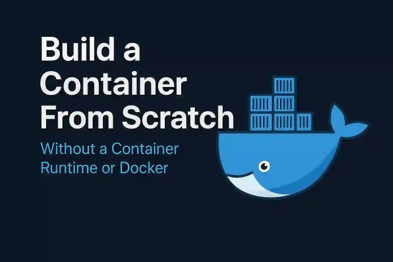

# CFS

> CFS stands for Container From Scratch

Here we aimed to demonstrate linux `namespaces` and a sample Go code show how docker uses namespaces to create containerized environments.

## resources

- <https://medium.com/swlh/build-containers-from-scratch-in-go-part-1-namespaces-c07d2291038b>

- <https://blog.quarkslab.com/digging-into-linux-namespaces-part-1.html>
- <https://blog.quarkslab.com/digging-into-linux-namespaces-part-2.html>
